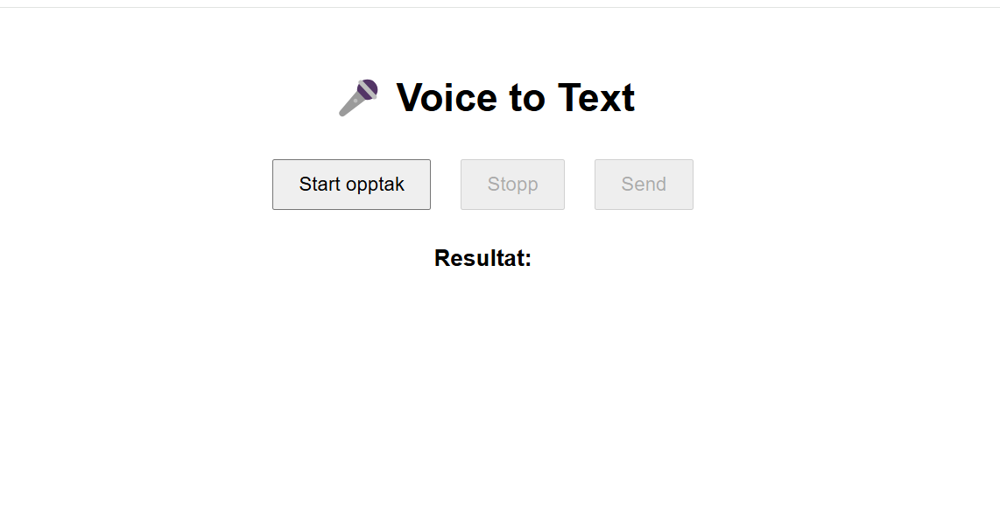
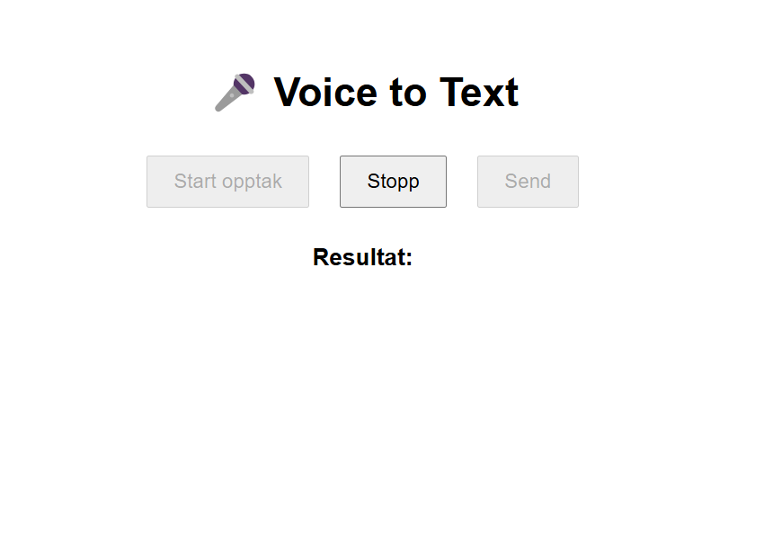
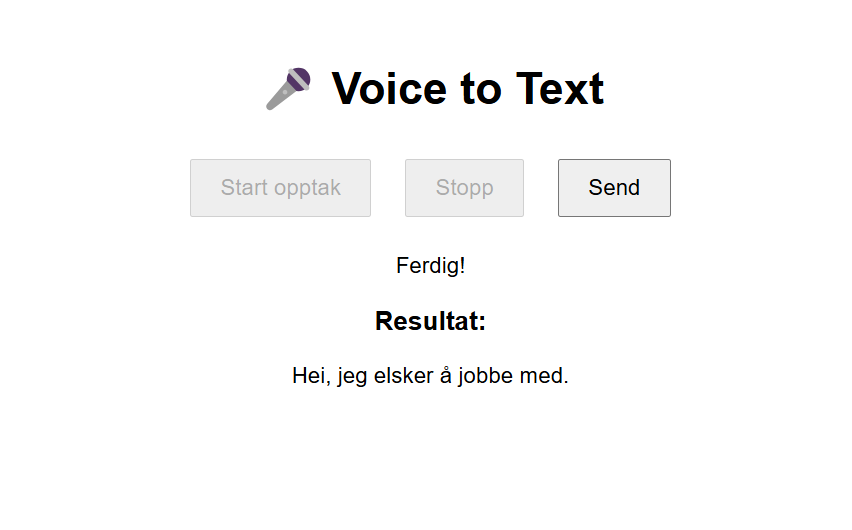

## 🚀 Demo
👉 https://voice2text-cho9.onrender.com/

# 🎙️ Voice2Text Web App

En fullstack webapplikasjon som lar brukere ta opp lyd i nettleseren og få den automatisk transkribert til tekst ved hjelp av OpenAI Whisper API.

---

## 🚀 Demo

👉 Live app:  https://voice2text-cho9.onrender.com/

---

## 📸 Screenshots

### 🎤 Opptak



### 📝 Resultat

---

## ✨ Funksjoner

- 🎤 Ta opp lyd direkte i nettleseren
- 📤 Send lyd til backend
- 🤖 Automatisk transkribering (Whisper API)
- 💾 Lagrer transkripsjoner i database
- ⚡ Rask respons via API

---

## 🧱 Tech Stack

- **Frontend:** HTML, CSS, JavaScript (MediaRecorder API)
- **Backend:** PHP (Docker, Render)
- **Database:** MySQL (Railway)
- **AI:** OpenAI Whisper API

---

## 📁 Prosjektstruktur
# 🎙️ Voice2Text Web App

En fullstack webapplikasjon som lar brukere ta opp lyd i nettleseren og få den automatisk transkribert til tekst ved hjelp av OpenAI Whisper API.

---

## 🚀 Demo

👉 Live app: [Legg inn URL her]

---

## 📸 Screenshots

### 🎤 Opptak


### 📝 Resultat


---

## ✨ Funksjoner

- 🎤 Ta opp lyd direkte i nettleseren
- 📤 Send lyd til backend
- 🤖 Automatisk transkribering (Whisper API)
- 💾 Lagrer transkripsjoner i database
- ⚡ Rask respons via API

---

## 🧱 Tech Stack

- **Frontend:** HTML, CSS, JavaScript (MediaRecorder API)
- **Backend:** PHP (Docker, Render)
- **Database:** MySQL (Railway)
- **AI:** OpenAI Whisper API

---

## 📁 Prosjektstruktur
voice2text/
│
├── frontend/
│ ├── index.html
│ ├── script.js
│ └── styles.css
│
├── backend/
│ ├── upload.php
│ ├── config.php
│ └── uploads/
│
├── Dockerfile
└── README.md

---

## ⚙️ Lokal utvikling

### 1. Klon repo

```bash
git clone https://github.com/your-username/voice2text.git
cd voice2text


Opprett .env
OPENAI_API_KEY=your_api_key

DB_HOST=your_host
DB_PORT=your_port
DB_USER=your_user
DB_PASS=your_password
DB_NAME=your_db

Start med Docker
docker build -t voice2text .
docker run -p 8080:80 voice2text

Database setup
CREATE TABLE transcriptions (
    id INT AUTO_INCREMENT PRIMARY KEY,
    filename VARCHAR(255) NOT NULL,
    text TEXT NOT NULL,
    user_id INT NOT NULL,
    created_at TIMESTAMP DEFAULT CURRENT_TIMESTAMP
);

☁️ Deployment
Backend (Render)
Deploy via Docker
Sett environment variables i dashboard
Database (Railway)

🔐 Sikkerhet
.env er ignorert via .gitignore
Ingen secrets i repo
Bruk environment variables i produksjon

🐛 Vanlige feil
❌ Unexpected token '<'

→ PHP error returneres som HTML

❌ mysqli not found

→ Installer extension i Docker:

RUN docker-php-ext-install mysqli
❌ Connection timed out

→ Feil DB host/port

📌 Videre utvikling
🔐 Brukerautentisering
📜 Historikkvisning
🎨 Bedre UI/UX
🌍 Flere språk

👨‍💻 Forfatter
GitHub: https://github.com/AbdiTeck

📄 Lisens

MIT License

